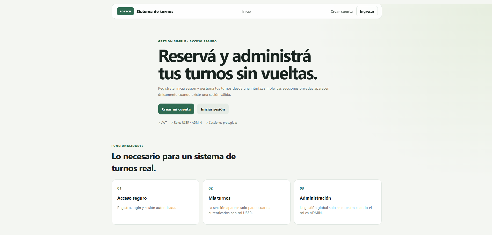
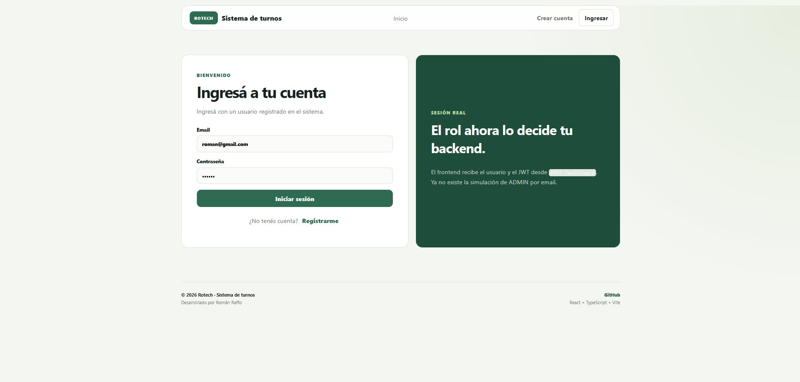
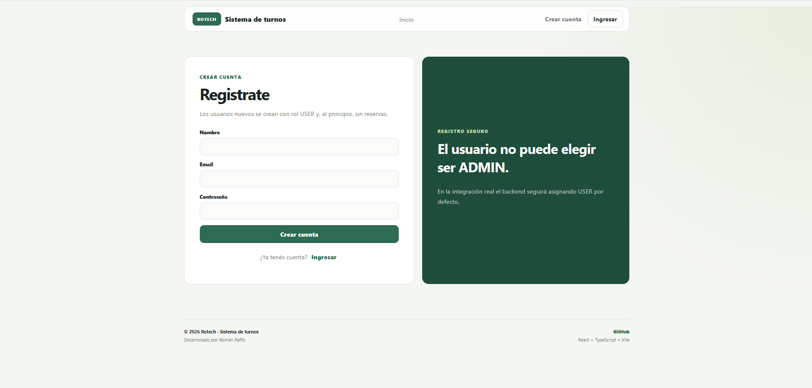
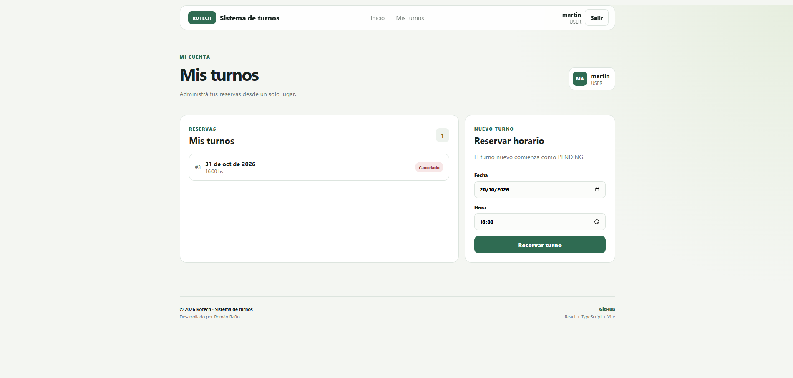
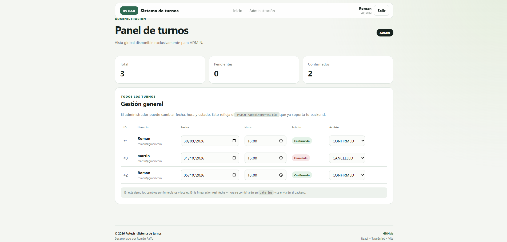

## Sistema de Gestión de Turnos

Aplicación web full stack para la gestión de turnos,
con autenticación, autorización por roles y persistencia
en PostgreSQL.

## Capturas de pantalla

### Main default

### Login

### Register

### portal de turnos - Usuario

### Administración de turnos

## Tecnologías

Frontend
- React
- TypeScript
- Vite

Backend
- Node.js
- Express
- TypeScript
- Prisma

Base de datos
- PostgreSQL
- Docker

Seguridad
- JWT
- bcrypt
- Role-based authorization

## Funcionalidades

- Registro e inicio de sesión
- Autenticación mediante JWT
- Roles USER / ADMIN
- Creación de turnos
- Cancelación de turnos
- Reprogramación
- Confirmación de turnos por administrador
- Control de conflictos
- Gestión administrativa
- Manejo centralizado de errores

## Arquitectura

Frontend → API REST → Controllers → Services → Prisma → PostgreSQL